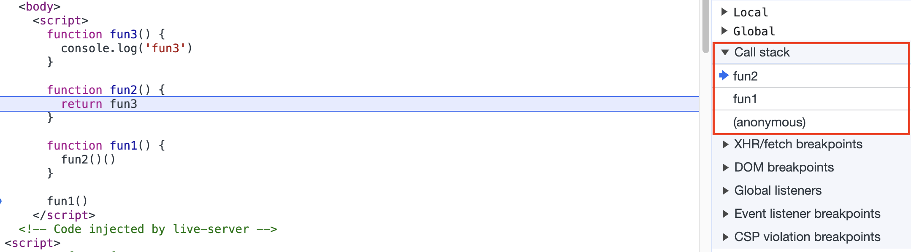
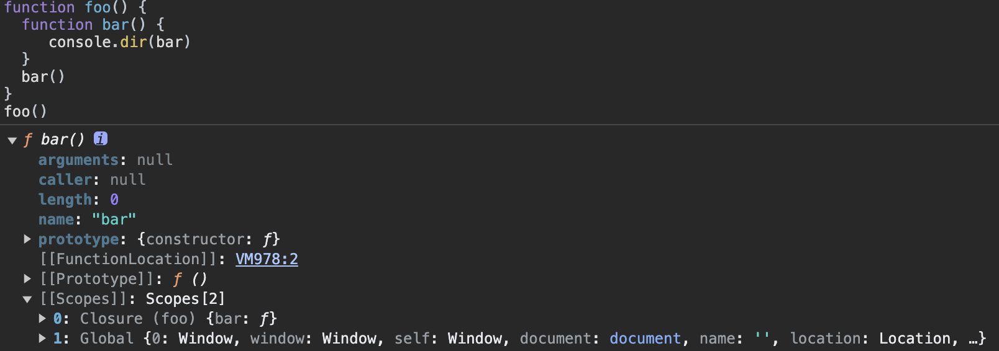

# JavaScript 深入系列之执行上下文

在 JavaScript 中，可执行的代码包含：

1. 全局代码
2. 函数代码
3. eval 代码

当执行一个函数的时候，就会创建一个**执行上下文**，用**执行上下文栈**管理多个**执行上下文**。

每个执行上下文，都有三个重要属性：

1. 变量对象
2. 作用域链
3. this

## 执行上下文栈

为了模拟执行上下文栈，我们可以定一个数组。

```js
ECStack = []
```

当 JS 开始解析代码的时候，最先遇到的就是全局代码。所以会先向执行栈压入一个全局执行上下文。只有当整个应用结束的时候，ECStack 才会被清空。

```js
ECStack = [globalContext]
```

让我们看看这段代码

```js
function fun3() {
  console.log('fun3')
}

function fun2() {
  return fun3
}

function fun1() {
  fun2()()
}

fun1()
```

📢：**当执行一个函数的时候，就会创建一个执行上下文，并且压入执行上下文栈，当函数执行完毕的时候，就会将函数的执行上下文从栈中弹出。**

```js
// 伪代码

// fun1()
ECStack.push(<fun1> functionContext);

// fun1 中调用了 fun2，创建 fun2 的执行上下文
ECStack.push(<fun2> functionContext);

// fun2 执行完毕，返回了 fun3，执行完毕就从栈中弹出，现在栈顶是 fun1
ECStack.pop();

// fun1 中继续调用，调用了 fun3，创建 fun3 的执行上下文
ECStack.push(<fun3> functionContext);

// fun3 执行完毕，弹出执行上下文栈
ECStack.pop();

// fun1 执行完毕，弹出执行上下文栈
ECStack.pop();

// javascript 接着执行下面的代码，但是 ECStack 底层永远有个 globalContext
```

> 所有的调用栈操作，可以通过打断点的方式在浏览器 Source 模块进行查看



## 变量对象

讲解了执行上下文栈之后，我们来详细的讲一讲执行上下文中包含的内容之一 —— 变量对象。

**变量对象存储了上下文中定义的变量和函数声明。**

在函数上下文中，我们使用活动对象表示变量对象。只有当进入到一个执行上下文中，这个执行上下文的变量对象才会被激活，所以叫做活动对象。活动对象通过函数的 arguments 属性初始化。

### 执行过程

分为两个阶段：

1. 先进行分析
2. 然后执行

#### 进入执行上下文

在进入执行上下文时，还没有执行代码，这时候活动对象包括：

1. 函数的所有形参(如果是函数上下文)
2. 函数声明
3. 变量声明

以下面 👇🏻 这段代码为示例：

```js
function foo(a) {
  var b = 2 // 变量声明
  function c() {} // 函数声明
  var d = function () {} // 变量声明
  b = 3 // 变量声明
}

foo(1)
```

在进入执行上下文后，他的活动对象（AO：Active Object）是：

```js
AO = {
  arguments: {
    0: 1,
    length: 1
  },
  a: 1,
  b: undefined,
  c: reference to function c(){},
  d: undefined
}
```

#### 代码执行

按顺序执行代码，修改变量对象的值，上面的例子中，执行代码过后，此时的 AO 是

```js
AO = {
  arguments: {
    0: 1,
    length: 1
  },
  a: 1,
  b: 3,
  c: reference to function c(){},
  d: reference to FunctionExpression "d"
}
```

> 📢：**在进入执行上下文时，首先会处理函数声明，其次会处理变量声明，如果变量名称和已经声明的形式参数或函数相同，则变量声明不会干扰已经存在的这类属性。**

在这段代码中：

```js
console.log(foo)

function foo() {
  console.log('foo')
}

var foo = 1
```

会打印 `foo` 函数。

#### 思考题

```js
function foo() {
  console.log(a)
  a = 1
}

foo() // Uncaught ReferenceError: a is not defined。

function bar() {
  a = 1
  console.log(a)
}
bar() // 1
```

在第一段中，因为函数中的 `a` 并没有通过 `var` 关键字进行**变量声明**，注意上文已经提到，进入一个上下文的时候，会考虑形参、函数声明、变量声明。所有不会被存放在 AO 中。

第一段 console 执行的时候，AO 的值是：

```js
AO = {
  arguments: {
    length: 0
  }
}
```

没有 `a` 的值，可能会去全局找，全局也没有，所以会报错。

第二段执行 console 的时候，全局对象已经存在了 `a` 属性，这时候会去全局对象查找，所以会打印 1。

## 作用域链

了解了变量对象之后，我们来看看执行上下文中的另一个组成部分：作用域链。

当查找变量的时候，会先从当前上下文的变量对象中查找。如果没有查找到，就会从父级执行上下文的变量中进行查找，一直到全局上下文的变量对象，也就是全局对象。

**这样由多个执行上下文的变量构成的链表就叫做作用域链。**接下来以一个函数的创建和激活来讲解作用域链是如何创建和变化的。

### 函数创建

**函数作用域在函数定义的时候就决定了**，这是因为函数有一个内部属性 `[[scope]]`。该属性可以通过浏览器打印出来查看。



当函数创建的时候，就会保存所有父变量对象到其中，你可以理解 `[[scope]]` 就是所有父变量对象的层级链，但注意：**`[[scope]]`并不代表完整的作用域链！**

```js
function foo() {
  function bar() {}
}
```

函数创建时，各自的 `[[scope]]` 为：

```js
foo.[[scope]] = [
  globalContext.VO
];

bar.[[scope]] = [
  fooContext.AO,
  globalContext.VO
];
```

### 函数激活

**当函数激活的时候，进入函数上下文，创建活动对象后，就会将活动对象添加到作用域的前端。**

这时候执行上下文的作用域链，我们命名为 Scope：

```js
Scope = [AO].concat([[Scope]])
```

到现在，作用域创建完毕。

### 例子

以下面的例子为例，结合着之前讲的变量对象和执行上下文栈，我们来总结一下函数执行上下文中作用域链和变量对象及执行上下文栈的创建过程：

```js
var scope = 'global scope'
function checkscope() {
  var scope2 = 'local scope'
  return scope2
}
checkscope()
```

**执行过程如下：**

一、先执行代码，在栈中压入全局执行上下文，该全局执行上下文有全局变量：`scope` 和函数 `checkscope`

```js
ECStack = [globalContext]
```

二、checkscope 函数被创建时，他的内部属性 `[[scope]]` 会保存当前的作用域链。

```js
checkscope.[[scope]] = [
  globalContext.VO // 全局执行上下文的变量对象
];
```

三、执行 checkscope 函数，创建 checkscope 函数执行上下文，checkscope 函数执行上下文被压入执行上下文栈

```js
ECStack = [checkscopeContext, globalContext]
```

四、checkscope 函数并不立刻执行，开始做准备工作，复制函数 `[[scope]]` 属性**创建作用域链**

```js
checkscopeContext = {
  Scope: checkscope.[[scope]],
}
```

五、用 `arguments` **创建活动对象**，随后初始化活动对象，加入形参、函数声明、变量声明

```js
checkscopeContext = {
  AO: {
    arguments: {
      length: 0
    },
    scope2: undefined
  }，
  Scope: checkscope.[[scope]],
}
```

六、**将活动对象压入 checkscope 作用域链顶端**

```js
checkscopeContext = {
  AO: {
    arguments: {
      length: 0
    },
    scope2: undefined
  },
  Scope: [AO, [[Scope]]]
}
```

七、准备工作做完，开始执行函数，随着函数的执行，修改 AO 的属性值

```js
checkscopeContext = {
  AO: {
    arguments: {
      length: 0
    },
    scope2: 'local scope'
  },
  Scope: [AO, [[Scope]]]
}
```

八、查找到 scope2 的值，返回后函数执行完毕，函数上下文从执行上下文栈中弹出

```js
ECStack = [globalContext]
```

> 可以看出：**执行栈先压入函数执行上下文，随后初始化函数执行上下文，创建变量对象、建立作用域链、确定 this 指向。最后，开始执行函数体中的代码。执行完之后，就会从栈中弹出。**

## this

- [关于 this 深度解析讲解](https://github.com/mqyqingfeng/Blog/issues/7)
